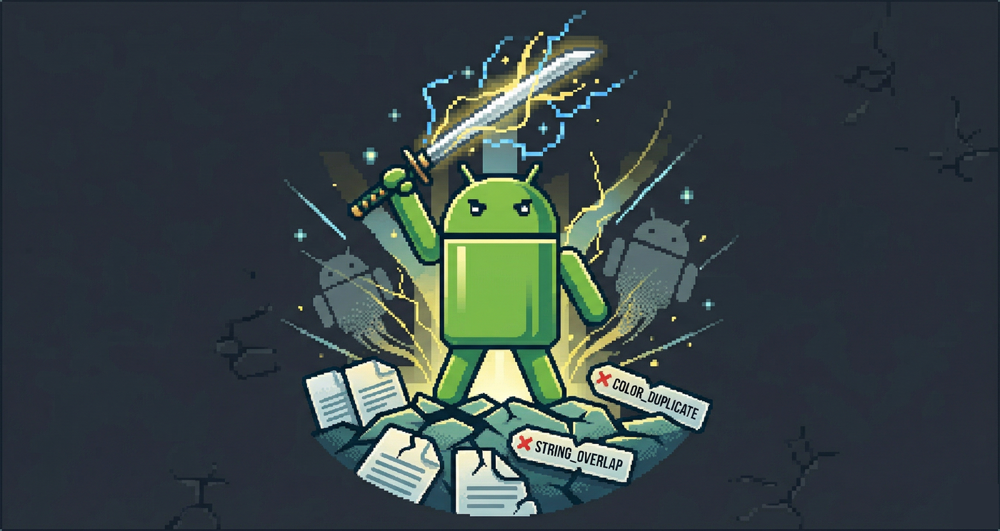

# ⚔️ Highlander

[](https://central.sonatype.com/artifact/io.github.fornewid.highlander/highlander)
[](https://plugins.gradle.org/plugin/io.github.fornewid.highlander)
[](https://github.com/fornewid/highlander/actions/workflows/build.yml)
[](LICENSE)



> :warning: This project is in an experimental stage. APIs and behavior may change without notice.

> **"There can be only one."**

A Gradle plugin that finds duplicate resources, assets, classes, and native libraries hiding across your Android dependencies — before they cause silent UI bugs, Dex merge failures, or runtime crashes.

## Why Use It?

When you add libraries to an Android project, duplicates can sneak in silently:

| Problem | What Happens | When You Find Out |
|---------|-------------|-------------------|
| **Duplicate resources** (`drawable/ic_close`) | AGP silently picks one by priority | Runtime — wrong icon/color appears |
| **Duplicate assets** (`config.json`) | Higher-priority module's file wins | Runtime — library reads wrong config |
| **Duplicate classes** (`a.a.class`) | Dex merge fails or wrong class loads | Build time or runtime crash |
| **Duplicate native libs** (`libc++_shared.so`) | Build fails, devs add `pickFirst` | Runtime — `UnsatisfiedLinkError` |

Highlander catches all of these **before they become problems**, using a baseline-based approach that integrates into your CI pipeline.

## Quick Start

### Step 1: Apply the Plugin

```kotlin
// build.gradle.kts (app module)
plugins {
    id("com.android.application")
    id("io.github.fornewid.highlander") version "<latest-version>"
}

highlander {
    configuration("release")
}
```

### Step 2: Generate a Baseline

```bash
./gradlew :app:highlanderBaseline
```

This creates baseline files in `highlander/` that record the current state of duplicates. **Commit these files to your repository.**

### Step 3: Detect Changes

```bash
./gradlew :app:highlander
```

If new duplicates appear (e.g., after adding a dependency), the build fails with a clear diff:

```
Highlander: Duplicates changed in :app (release)

=== resources ===
+ drawable/ic_close:
+   - :app (.xml)
+   - com.example:sdk:1.0 (.png)

If this is expected, re-baseline with:
  ./gradlew :app:highlanderBaselineRelease
```

## Configuration

```kotlin
highlander {
    baselineDir.set("highlander") // default

    configuration("release") {
        resources = true               // Scan res/ file-based resources
        assets = true                  // Scan assets/
        nativeLibs = false             // Scan .so native libraries
        valuesResources = false        // Scan values/ XML entries (strings, colors, etc.)
        classes = false                // Scan Java/Kotlin classes in JARs/AARs
        excludeAndroidXValues = true   // Drop androidx.* sources from the values scan
    }
}
```

### Options

| Option | Default | Description |
|--------|---------|-------------|
| `resources` | **`true`** | Detect duplicate file-based resources (`drawable`, `layout`, `mipmap`, etc.) |
| `assets` | **`true`** | Detect duplicate asset files |
| `nativeLibs` | `false` | Detect duplicate `.so` native libraries per ABI |
| `valuesResources` | `false` | Detect duplicate values entries (`string`, `color`, `dimen`, etc.) |
| `classes` | `false` | Detect duplicate Java/Kotlin classes across dependency JARs/AARs |
| `excludeAndroidXValues` | **`true`** | Filter out `androidx.*` sources from the values scan only |
| `baselineDir` | `"highlander"` | Directory for baseline files |

**Note on `excludeAndroidXValues`**: AndroidX components (Compose, Core, etc.) routinely share benign values declarations by design. Filtering them out keeps the values baseline signal-to-noise high. Set to `false` to include AndroidX entries. No effect unless `valuesResources = true`. Run with `--info` to see how many AndroidX sources were excluded and how many unknown-origin sources remain (unknown-origin sources such as `files()` or some composite-build setups are not matched by the filter).

**Note on values id-slot skip**: the values scan automatically skips empty-body `<item type="id" name="..."/>` (and the shorthand `<id name="..."/>`) declarations. AAPT2 treats these as weak `Id` values that merge across libraries without runtime conflict, so reporting them would be false-positive noise.

## Baseline Files

Each scan type produces a separate baseline file:

```
highlander/
├── releaseResources.txt     # res/ duplicates
├── releaseAssets.txt        # assets duplicates
├── releaseNativeLibs.txt    # .so duplicates         (if nativeLibs = true)
├── releaseValues.txt        # values entry duplicates (if valuesResources = true)
└── releaseClasses.txt       # class duplicates       (if classes = true)
```

### Classification

Each entry is tagged with one of three labels indicating how AGP will resolve the duplicate:

| Tag | Meaning | Action |
|-----|---------|--------|
| `# override` | The app module is one of the sources — AAPT's "last wins" rule makes the app's copy win | Usually intentional |
| `# conflict` | External dependencies only, file bytes differ — AGP picks one by priority, behavior can change | Review the diff |
| `# duplicate-safe` | All sources have byte-identical content — AAPT merges deterministically, no runtime difference | Informational |

Classification matrix by scan type:

| Scan | `override` | `conflict` | `duplicate-safe` |
|------|:---:|:---:|:---:|
| `resources` | ✓ | ✓ | ✓ |
| `assets` | ✓ | ✓ | ✓ |
| `nativeLibs` | ✓ | ✓ | — |
| `classes` | ✓ | ✓ | — |
| `valuesResources` | ✓ | ✓ | — |

`duplicate-safe` requires byte-level comparison, which is only performed for `resources` and `assets` today.

### Example

```
# override
drawable/ic_close:
  - :app (.xml)
  - com.example:lib:1.0 (.png)

# conflict
config.json:
  - com.sdk.a:core:1.0
  - com.sdk.b:analytics:2.0

# duplicate-safe
drawable-anydpi-v21/ic_shared:
  - androidx.media3:media3-ui:1.4.1 (.xml)
  - com.google.android.exoplayer:exoplayer-ui:2.18.7 (.xml)
```

### Classification flips

If a duplicate's classification changes (e.g. a dependency upgrade makes bytes match, turning `conflict` into `duplicate-safe`), the guard reports a single `~` line for that key:

```
~ drawable/ic_shared (conflict -> duplicate-safe):
    - androidx.media3:media3-ui:1.4.1 (.xml)
    - com.google.android.exoplayer:exoplayer-ui:2.18.7 (.xml)
```

Re-run `highlanderBaseline` to accept the transition.

## Requirements

- Android Gradle Plugin **8.0.0** or higher
- Gradle **8.0** or higher
- Applied to `com.android.application` modules only. Library modules are not supported.

## AI Agent Guide

If you use an AI coding assistant (Claude Code, Copilot, Gemini, Cursor, etc.),
reference the [setup guide](docs/setup-guide.md.txt) for accurate installation
instructions and common pitfalls.

## Acknowledgments

Inspired by [dependency-guard](https://github.com/dropbox/dependency-guard) and [manifest-shield](https://github.com/fornewid/manifest-shield).

## License

[Apache License 2.0](LICENSE)
